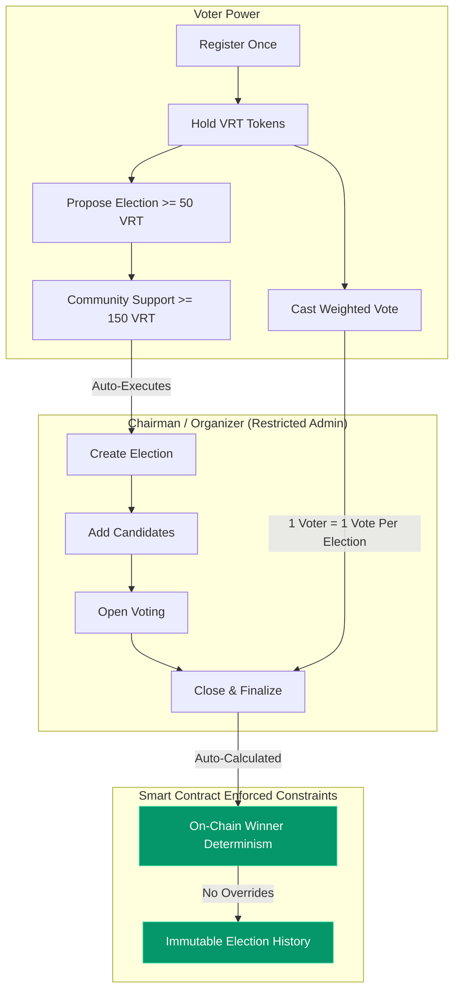

# VeritasDAO 🏛️

### Transparent, Verifiable, and Sequential On-Chain Governance

[](https://soliditylang.org/)
[](https://getfoundry.sh/)
[](https://react.dev/)
[](https://www.typescriptlang.org/)
[](https://wagmi.sh/)
[](https://tailwindcss.com/)
[-059669>)](https://scan.bohr.life/)

**VeritasDAO** is a production-grade Web3 decentralized governance and election protocol deployed on **Bohr Testnet**. It enables communities and decentralized autonomous organizations to organize sequential, tamper-proof elections, vote with snapshot-weighted governance token balances ($VRT$), deterministically calculate winners on-chain, and maintain a permanent, queryable historical record of all elections.

---

## 🌟 Core Value Proposition & Governance Model

```
 ┌─────────────────┐       ┌─────────────────┐       ┌─────────────────┐
 │ 1. Register     │       │ 2. Hold Tokens  │       │ 3. Join Election│
 │ One-Time Voter  │ ────► │ Claim 100 $VRT  │ ────► │ View Candidates │
 │ Identity Check  │       │ Governance Power│       │ & Open Ballots  │
 └─────────────────┘       └─────────────────┘       └─────────────────┘
                                                              │
 ┌─────────────────┐       ┌─────────────────┐                │
 │ 6. Archive      │       │ 5. Finalize     │       ┌────────▼────────┐
 │ Immutable On-   │ ◄──── │ On-Chain Winner │ ◄──── │ 4. Cast Vote    │
 │ Chain History   │       │ Determination   │       │ Snapshot Weight │
 └─────────────────┘       └─────────────────┘       └─────────────────┘
```

1. **Register Once**: Voters register their address on-chain once. This separates voter identity authorization from token balances and prevents Sybil creation during active ballots.
2. **Hold Governance Tokens ($VRT$)**: Governance power is backed by an ERC-20 token ($VRT$). A built-in public testnet faucet allows immediate testing (100 VRT per claim).
3. **Sequential Multi-Election Lifecycle**: Independent election cycles (`Upcoming` ➔ `Open` ➔ `Closed` ➔ `Finalized`) each maintain isolated candidate sets, start/end timestamps, and specific agendas.
4. **Snapshot-Weighted Voting**: Voting weight is locked to the voter's exact $VRT$ balance at the instant of vote casting ($1 \text{ VRT} = 1 \text{ Weight}$). Tokens transferred after voting cannot affect the recorded weight or enable double-voting.
5. **Deterministic Winner Calculation**: When an election is closed, the winning candidate is calculated on-chain by iterating candidate tallies. Ties are explicitly flagged (`isTie = true`, `winnerCandidateId = 0`) to ensure 100% transparent auditability.
6. **Immutable Historical Archive**: Finalized election results, vote totals, candidate rankings, and timestamps are permanently archived on-chain and accessible via `getElectionHistory()`.
7. **Decentralized Community Proposals**: Beyond the Chairman, community members with $\ge 50\text{ VRT}$ can propose new elections. Once supported by $\ge 150\text{ VRT}$ cumulative weight, anyone can execute the proposal into a live election.

---

## 🌐 Live Bohr Testnet Deployment

VeritasDAO is live and fully verified on the **Bohr Testnet**:

| Parameter                            | Value                                                                                                                     |
| :----------------------------------- | :------------------------------------------------------------------------------------------------------------------------ |
| **Network Name**                     | Bohr Testnet                                                                                                              |
| **Chain ID**                         | `968`                                                                                                                     |
| **RPC Endpoint**                     | `https://rpc.bohr.life`                                                                                                   |
| **Block Explorer**                   | [https://scan.bohr.life](https://scan.bohr.life)                                                                          |
| **Native Gas Token**                 | `BOT`                                                                                                                     |
| **VeritasDAO Core Contract**         | [`0xBBa1e3CbaC23E0B25ACa52244858B66Dec9979eb`](https://scan.bohr.life/address/0xBBa1e3CbaC23E0B25ACa52244858B66Dec9979eb) |
| **Veritas Governance Token ($VRT$)** | [`0xFbe652f579E6c3605269cF4Cd5ce8C660f7ea370`](https://scan.bohr.life/address/0xFbe652f579E6c3605269cF4Cd5ce8C660f7ea370) |
| **Chairman / Deployer Address**      | `0x97184EBAEB9FDCe449d5FbaF1311601005F8E811`                                                                              |

### Live Deployed State on Bohr Testnet

- **Election #1 (_Finalized Archive_)**: _"Genesis Governance Council 2026"_ — Finalized with winning candidate _"Dr. Elena Vance (Core Protocol Architecture)"_ (Tx: `0x789b708e9067b848243be4443a6081467a149c5eb4519965d1305417ec62fbc0`).
- **Election #2 (_Open Live Ballot_)**: _"Treasury Capital Allocation Committee"_ — Open with 3 competing candidate proposals ready for community votes.
- **Election #3 (_Upcoming Setup_)**: _"Ecosystem Grants & Bounties Reviewer"_ — Configured in setup stage.
- **Proposal #1 (_Community Proposal_)**: _"AI Security Audit Working Group"_ — Active community proposal gathering VRT weight.

---

## 🔒 Security Architecture & Trust Boundaries



### Key Security Safeguards

1. **No Result Manipulation**: The Chairman/Organizer cannot pick winners, edit vote counts, or alter election outcomes. The contract determines the winner algorithmically.
2. **Double-Voting Prevention**: An on-chain mapping `hasVoted[electionId][voterAddress]` ensures each voter can cast at most one ballot per election.
3. **Token Balance Snapshot**: `vote()` records `governanceToken.balanceOf(msg.sender)` at the exact block execution time. Transferring tokens afterwards has zero effect on past ballots.
4. **Candidate Isolation**: Candidates belong strictly to their parent `electionId`. Adding a candidate to Election #2 never bleeds into Election #1.
5. **State Transition Enforcement**: Elections strictly progress through `Upcoming` ➔ `Open` ➔ `Closed` ➔ `Finalized`. Votes are only accepted during `Open` status.
6. **Graceful Tie Handling**: When multiple candidates share the exact maximum vote tally, `isTie` is set to `true` and `winnerCandidateId` is set to `0`, preventing arbitrary tie resolution.

---

## 📁 Repository Structure

```
VeritasDAO/
├── contract/                       # Smart Contracts & Foundry Suite
│   ├── src/
│   │   ├── VeritasDAO.sol          # Core DAO governance & election engine
│   │   └── VeritasGovernanceToken.sol # ERC-20 token ($VRT$) with public faucet
│   ├── test/
│   │   └── VeritasDAO.t.sol        # 19 comprehensive Foundry unit & integration tests
│   ├── script/
│   │   ├── DeployVeritasDAO.s.sol  # Deployment script for Bohr Testnet
│   │   └── SeedLiveElections.s.sol # On-chain state seeding script
│   └── foundry.toml                # Foundry configuration (via_ir = true)
│
├── frontend/                       # Vite + React 19 + TypeScript dApp
│   ├── src/
│   │   ├── components/
│   │   │   ├── Navbar.tsx          # Responsive navigation & network status
│   │   │   ├── Footer.tsx          # Bohr Testnet links & explorer triggers
│   │   │   ├── WalletButton.tsx    # Reown AppKit connector button
│   │   │   └── FaucetModal.tsx     # 1-Click 100 VRT Testnet Faucet
│   │   ├── pages/
│   │   │   ├── HomePage.tsx        # Hero, protocol metrics, flow walkthrough
│   │   │   ├── DashboardPage.tsx   # Voter profile, token balance, voting power
│   │   │   ├── RegisterPage.tsx    # One-time voter registration portal
│   │   │   ├── ElectionsPage.tsx   # Sequential elections grid with search/filter
│   │   │   ├── ElectionDetailPage.tsx # Real-time voting, candidate platforms, stats
│   │   │   ├── HistoryPage.tsx     # Permanent on-chain election archive
│   │   │   ├── ChairmanPage.tsx    # Organizer hub (Create, Add Candidates, Finalize)
│   │   │   ├── GovernancePage.tsx  # Community proposals & decentralized activation
│   │   │   └── ActivityPage.tsx    # Live on-chain event stream from Bohr RPC
│   │   ├── config/
│   │   │   ├── wagmi.ts            # Wagmi & Reown AppKit configuration
│   │   │   └── contracts.ts        # Contract addresses & ABIs
│   │   ├── hooks/
│   │   │   └── useVeritasDAO.ts    # Custom Wagmi hooks for all contract interactions
│   │   └── types/                  # TypeScript interface definitions
│   ├── package.json
│   ├── vite.config.ts
│   └── tailwind.config.js
└── README.md
```

---

## 🧪 Testing & Verification

The smart contract test suite includes **19 automated unit & integration tests** covering registration, double voting prevention, candidate isolation, token-weighted tallying, sequential elections, tie breaking, community proposals, and cooldown faucet claims.

### Run Smart Contract Tests

```bash
cd contract
forge test -vvv
```

**Test Results Summary**:

```
Ran 19 tests for test/VeritasDAO.t.sol:VeritasDAOTest
[PASS] test_AddCandidate_Success() (gas: 115749)
[PASS] test_Admin_TransferChairman() (gas: 43493)
[PASS] test_CommunityProposal_Execute() (gas: 301292)
[PASS] test_CommunityProposal_Lifecycle() (gas: 157297)
[PASS] test_CommunityProposal_Revert_BelowThreshold() (gas: 74768)
[PASS] test_Election_CompleteLifecycle() (gas: 457813)
[PASS] test_Election_TieHandling() (gas: 421689)
[PASS] test_Faucet_CooldownEnforced() (gas: 67362)
[PASS] test_Faucet_Success() (gas: 82062)
[PASS] test_GetElectionHistory() (gas: 457889)
[PASS] test_InitialState() (gas: 27958)
[PASS] test_RegisterVoter_DuplicateRevert() (gas: 60718)
[PASS] test_RegisterVoter_Success() (gas: 60515)
[PASS] test_Revert_AddCandidate_AfterOpen() (gas: 147571)
[PASS] test_Revert_AddCandidate_NonChairman() (gas: 62413)
[PASS] test_Revert_Vote_ClosedElection() (gas: 228965)
[PASS] test_Revert_Vote_DoubleVoting() (gas: 236402)
[PASS] test_Revert_Vote_UnregisteredVoter() (gas: 181283)
[PASS] test_Revert_Vote_ZeroBalance() (gas: 184511)
Suite result: ok. 19 passed; 0 failed; 0 skipped
```

---

## 💻 Local Development Setup

### 1. Prerequisites

- [Foundry](https://getfoundry.sh/) (`forge`, `cast`)
- [Node.js](https://nodejs.org/) (v18+ or v20+)
- [npm](https://www.npmjs.com/)

### 2. Smart Contract Setup & Local Build

```bash
# Clone the repository
git clone https://github.com/your-repo/VeritasDAO.git
cd VeritasDAO/contract

# Build contracts
forge build

# Run unit tests
forge test
```

### 3. Frontend Setup & Local Development

```bash
cd ../frontend

# Install dependencies
npm install

# Run Vite development server
npm run dev
```

Open [http://localhost:5173](http://localhost:5173) in your browser.

### 4. Frontend Production Build & Linting

```bash
# Run linter
npm run lint

# Build optimized production bundle
npm run build
```

---

## 🚀 Step-by-Step User Journey

1. **Connect Wallet**: Click **Connect Wallet** in the top right navigation bar to connect MetaMask, Rainbow, Coinbase Wallet, or WalletConnect to **Bohr Testnet** (Chain ID: `968`).
2. **Claim Testnet $VRT$**: Click the **Claim $VRT$** button in the header. Claim 100 free $VRT$ governance tokens from the on-chain faucet.
3. **Register Voter Profile**: Navigate to **Registration**, enter your name and email/handle, and submit your one-time on-chain registration transaction.
4. **Explore Elections**: Browse the **Elections** tab to view open, upcoming, and finalized sequential elections.
5. **Cast Your Vote**: Open an active election (e.g. _Treasury Capital Allocation Committee_), review candidate agendas, select your preferred candidate, inspect your snapshot voting weight, and click **Submit On-Chain Vote**.
6. **Track Live Results**: Watch candidate vote tallies update in real-time as Bohr Testnet blocks are minted.
7. **Inspect Election History**: Visit **History** to view all permanently archived elections with winning candidates, total weights, and block timestamps.
8. **Decentralized Governance**: Visit **Proposals** to sponsor or vote on new community-initiated election ballots.

---

## 📜 License

This project is open-source software licensed under the [MIT License](LICENSE).
